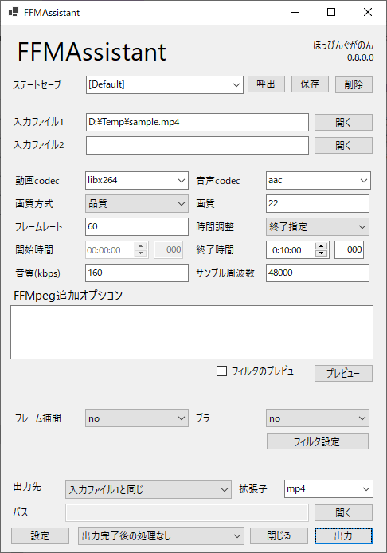
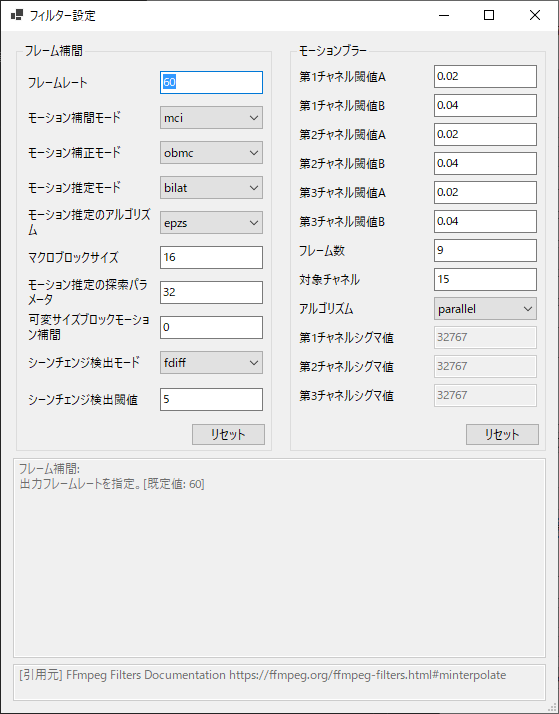
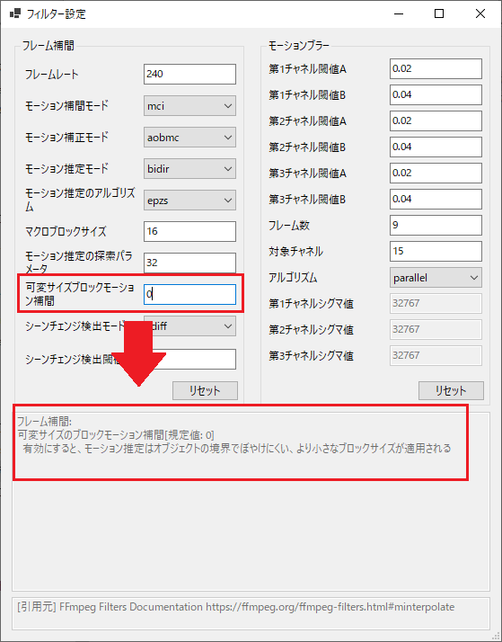
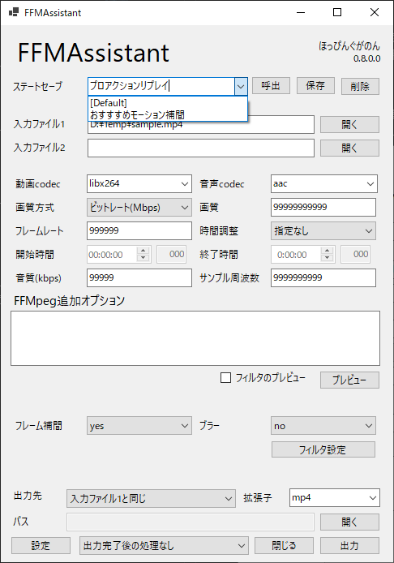
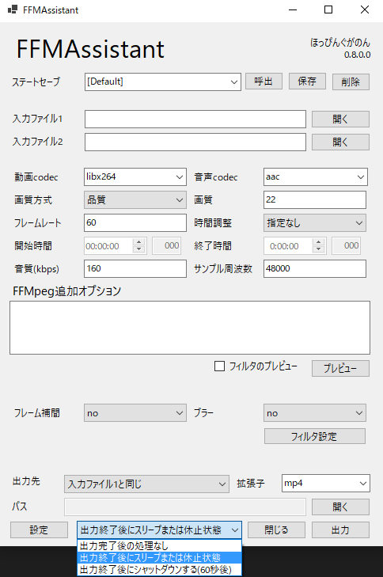
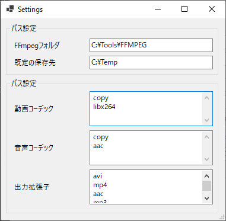
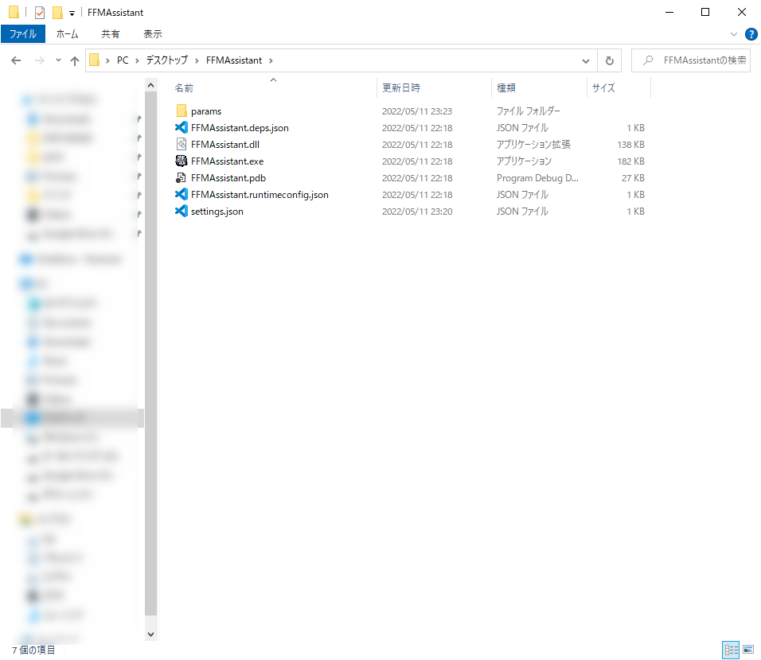
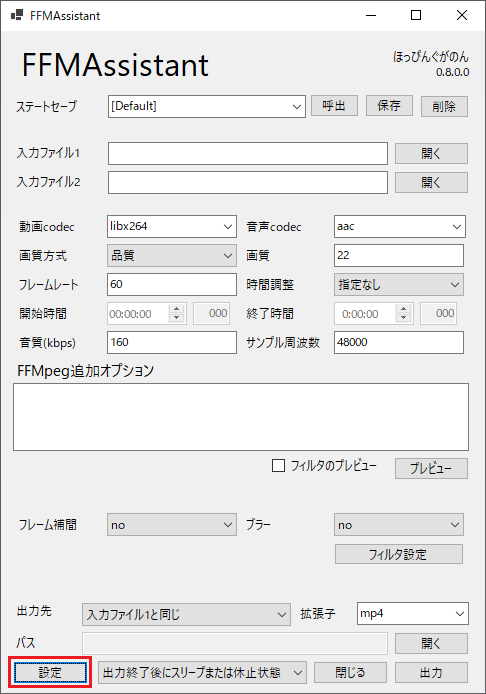
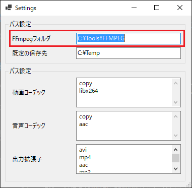

# FFMAssistant
## 概要
高機能だけど少し使いにくい動画変換ソフトウェア「FFmpeg」を直感的に使いやすいようにWindowsフォームで操作出来るようにしたアプリケーションです。特に、フレーム補間を気軽に利用できるように仕上げてあります。

## 機能説明
### 動画および音声ファイルの変換
動画や音声のコーデック、フレームレートやビットレート等を指定して、簡単にファイルを変換できます。

### フレーム補間
フレームのモーションを予測して、存在しないコマを生成することでフレームレートを上げるフレーム補間が可能です。

また、それぞれのパラメータの説明を和訳（ほっぴんぐがのんによるガバガバ翻訳）した文章が、下部に表示されるため、より直感的にパラメータを設定できます。

また、「フィルタのプレビュー」をチェックした状態でプレビューボタンをクリックすると、リアルタイムでフィルターをかけながらプレビューできます。ただし、FFmpegのフレーム補間は高速とは言えないものなので、めちゃくちゃ強いPCを持ってる方のみどうぞ()。

### モーションブラー
フィルター設定は可能ですが、現状うまく反映されません。FFmpegのフィルターを調整中です。

### 設定情報のステートセーブ
設定項目はステートセーブ可能です。

### 出力完了後にPCを落とす
フレーム補間処理は、かなり時間がかかることも多いので、処理完了後にPCをシャットダウンしたり、休止状態またはスリープに設定できます。

### コーデックリストの編集
FFmpegは沢山のコーデックに対応しています。普段よく使用するコーデックをリストに登録し、不要なものは削除することで利便性が向上します。もちろんリストに追加しなくてもコーデックは直接入力で指定することも可能です。

## 導入方法
### FFMAssistantの配置
GitHubのReleaseから、「FFMAssistant-x.x.x.zip」をダウンロードして、解凍する。
どこでもいいので、使いやすい場所にFFMAssistantを配置する。

### FFmpegの導入
FFmpegを導入する。すでに導入済みの場合は省略可。
導入方法は探せば沢山出てくるので省略。

### FFmpegフォルダの設定
現状、環境変数PATHにFFmpegが設定されていても、FFmpegを認識できません。

まず、最初に開いた画面の「設定」ボタンを押してください。

「FFmpegフォルダ」にFFmpegが存在するパスを入力してください。

以上で導入は完了です。

## 使用方法
追記予定

